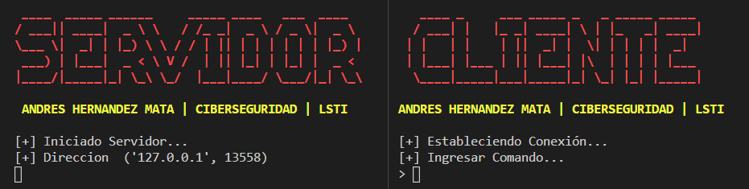

# Backdoor-Shell
Un shell remoto (remote shell) es un programa que puede ejecutar comandos de shell como otro usuario desde otra computadora a través de la red, usando el modelo cliente-servidor. Cuando este programa no es legítimo o se utiliza para fines no permitidos o ilícitos, recibe el nombre de puerta trasera (backdoor).

## Sistema Operativo
- Windows 10

## Versión
- Python 3.9.1

## Instalación
```python	

> pip install -r requirements.txt

```

## Ejecución
Debes ejecutar primero el programa del servidor.

```python	

> python src\backdoor_servidor.py

```

En otra terminal ejecuta el programa del cliente.

```python	

> python src\backdoor_cliente.py

```

Para finalizar la conexión del cliente y servidor, ingresa en la terminal del cliente el comando exit.

```	
[+] Ingresar comando...
> exit
[+] Cerrando conexion...
[+] Saliendo...
[-] Bye...
```

## Ejemplo



